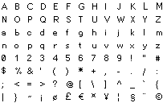
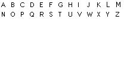

<h1 align="center">
	<a href="https://sprngr.github.io/px2bfm/" target="_blank" alt="Go to Web App">
        
    </a>
</h1>

> Parse pixels to [BitFontMaker2](http://www.pentacom.jp/pentacom/bitfontmaker2/) JSON font format


[](https://travis-ci.org/sprngr/px2bfm)
[](https://www.npmjs.com/package/px2bfm)


Pixels 2 [BitFontMaker2](http://www.pentacom.jp/pentacom/bitfontmaker2/) (aka px2bfm) is a simple command line tool (& [web app](https://sprngr.github.io/px2bfm/)) with the intention of
allowing you to use your desired pixel editor to draw font glyphs, creating compatible BitFontMaker2 JSON, and allowing you to import it to generate a new bitmap font. This doesn't replace the app, just supports it.

# Table of Contents

- [Web App](#web-app)
- [Installation](#installation)
	- [Alternative Installation](#alternative-installation)
- [Usage](#usage)
	- [Important Notes](#important-notes)
	- [Example Sprite Sheet & Output](#example-sprite-sheet-output)
- [Character Support](#character-support)
- [Download Template](#download-template)
- [License](#license)

# [Web App](https://sprngr.github.io/px2bfm/)

It runs exactly the same library on npm, just packaged up neatly within a GitHub hosted site. The only requirements here are to have compatible sprite sheets, template downloads
and other important usage information can be found below in this README.

# Installation
> This package requires npm and node.js. If you don't have npm or node.js on your local machine, check out [this guide on getting setup](https://docs.npmjs.com/getting-started/installing-node).

```console
$ npm install --global px2bfm
```

## Alternative Installation

If you don't feel like installing it globally via npm, you can clone this repo and run the script directly:
```console
$ ./bin/px2bfm
```

# Usage
```console
$ px2bfm --help

  Usage: px2bfm [options] <file>

  Parse pixels to BitFontMaker2 JSON font format
  For more info visit https://github.com/sprngr/px2bfm

  Options:

    -v, --version              output the version number
    -f, --fontname <fontname>  add name of the font
    -c, --creator <creator>    add name of the font creator
    -h, --help                 output usage information
```

The `fontname` and `creator` arguments are optional, but you'll probably want to set that at some point.

Example:
```console
$ px2bfm yourFileHere.png
# Output: {A lot of JSON}
```

To get this into a file:
```console
$ px2bfm yourFileHere.png > bfm2.json # Or whatever you want to call it
```

To put it on the clipboard to paste into the textfield on the web app:

**MacOS**
```console
$ px2bfm yourFileHere.png | pbcopy
```

**Windows**
```console
# I'm pretty sure this is a standard tool
$ px2bfm yourFileHere.png | clip
```

**Linux**
```console
# Let's be honest, if you're on linux you're a pro at this so why do I need to tell you
$ px2bfm yourFileHere.png | xclip
```

## Important Notes

Using one of the font templates provided (or your own, as long as it fits within required dimensions), create a pixel font.

Sprite sheets must have a width of 208px to maintain some parity with the layout of BitFontMaker2.
The height of the file must be a power of 16 (default is 128px), this will allow for future support of extended character sets.

Be sure to use black (hex #000000 / rgba 0, 0, 0) for glyph pixels, the image parser only cares about those. Any other colors & alpha values are ignored.

Each glyph must fit within a 16x16 pixel block, this is required by the web app.

## Example Sprite Sheet & Output

> Input



> Output

```JSON
{
	"33": [0, 0, 0, 0, 8, 8, 8, 8, 8, 8, 0, 8, 0, 0, 0, 0],
	"34": [0, 0, 0, 0, 20, 20, 20, 0, 0, 0, 0, 0, 0, 0, 0, 0],
	"35": [0, 0, 0, 0, 0, 40, 40, 124, 40, 124, 40, 40, 0, 0, 0, 0],
	...
	"name": "PixelFont",
	"copy": "PixelFontMaker",
	"letterspace": "64",
	"basefont_size": "357",
	"basefont_left": "62",
	"basefont_top": "0",
	"basefont": "None",
	"basefont2": ""
}
```

# Character Support
Currently this supports the first set of 104 characters on BitFontMaker2:
```
# Set 1
ABCDEFGHIJKLM
NOPQRSTUVWXYZ
abcdefghijklm
nopqrstuvwxyz
0123456789!"#
$%&'()*+,-./:
;<=>?@[\]^_`{
|}~¡¢£€¤¥¦§¨©
```
Extended character support is planned for the future, as well as the additional 90 character slots allowed.

# Download Template
Font template includes guides. The blue dotted line creates the grid of 16x16 blocks, the red lines are the baseline like in the web app.



## Downloads
* [.ase (Aseprite) format](https://github.com/sprngr/px2bfm/blob/master/templates/template.ase?raw=true)
* [.png format](https://github.com/sprngr/px2bfm/blob/master/templates/template.png?raw=true)

# License
MIT &copy; [Michael Springer](https://github.com/sprngr) 2018

BitFontMaker2 is the property of Pentacom.
