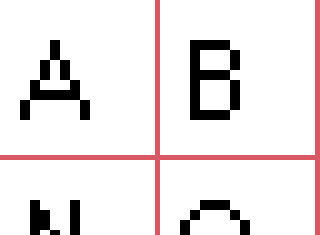

## Manual

### What this does
This tool takes a sprite sheet of 16x16 glyphs, and reads the pixel data to generate
a compatible JSON object with that of [BitFontMaker2](http://www.pentacom.jp/pentacom/bitfontmaker2/).

### What this is does not do
This does not read the characters or generate a ttf, just uses simple image pixel data to calculate
the values for BitFontMaker2. So as such it has some limitations when it comes to image processing,
namely the dimensions provided. The restrictions are more in place to be more accurate to working
with BitFontMaker2.

### How it works
px2bfm works by turning the uploaded image into a buffer of pixels, and iterates through it pixel by pixel
and looks at the color and positioning. It chunks it into 16px sprites, and calculates a bitmask value
one row at a time. It ignores every value except for Black `#000000`. This allows you to keep guide lines
and other things within your file and not have to worry about it messing up the conversion.



### Requirements
To utilize this, there are some minor requirements.

Image size must be 208px wide, this allows us to keep a consistent mapping with the BitFontMaker2 app.

The height however may be any power of 16, up to 128px. Every 16px is a new row of characters. This allows us to give some flexibility to the list of characters and not requiring you to have a massive file if you
only want to support a small amount.

### Example Sprite Sheet & Output

> Input


> Output

```JSON
{
	"33": [0, 0, 0, 0, 8, 8, 8, 8, 8, 8, 0, 8, 0, 0, 0, 0],
	"34": [0, 0, 0, 0, 20, 20, 20, 0, 0, 0, 0, 0, 0, 0, 0, 0],
	"35": [0, 0, 0, 0, 0, 40, 40, 124, 40, 124, 40, 40, 0, 0, 0, 0],
	...
	"name": "PixelFont",
	"copy": "PixelFontMaker",
	"letterspace": "64",
	"basefont_size": "357",
	"basefont_left": "62",
	"basefont_top": "0",
	"basefont": "None",
	"basefont2": ""
}
```

# Character Support
Currently this supports the first set of 104 characters on BitFontMaker2:
```
# Set 1
ABCDEFGHIJKLM
NOPQRSTUVWXYZ
abcdefghijklm
nopqrstuvwxyz
0123456789!"#
$%&'()*+,-./:
;<=>?@[\]^_`{
|}~¡¢£€¤¥¦§¨©
```
Extended character support is planned for the future, as well as the additional 90 character slots allowed.

### Template Downloads
- [.ase (Aseprite) format](https://github.com/sprngr/px2bfm/blob/master/templates/template.ase?raw=true)
- [.png format](https://github.com/sprngr/px2bfm/blob/master/templates/template.png?raw=true)

### Also available on npm
The library this web app uses is [available on npm](https://www.npmjs.com/package/px2bfm) as a command line tool. All functions are the same,
just without the front end.

```shell
$ npm install --global px2bfm
```

More information can be found in the px2bfm [GitHub repository](https://github.com/sprngr/px2bfm).

[back](./)
